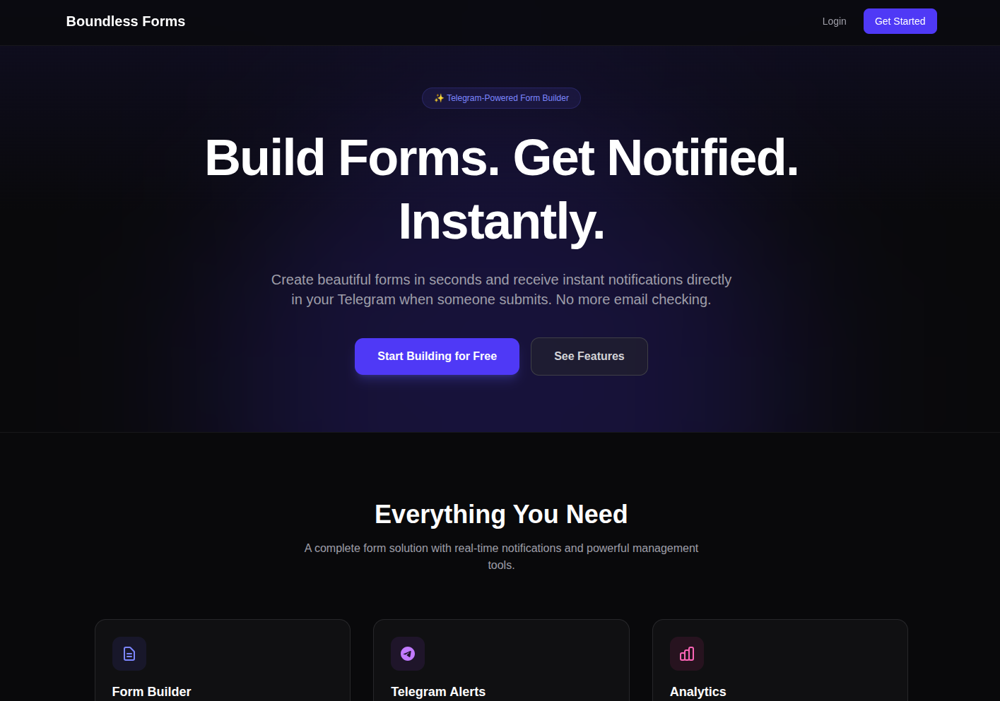

This is a Next.js application that provides a dashboard for creating custom forms and collecting submissions. It integrates with a Telegram bot to notify form owners of new submissions directly in their DMs.


## Features

- **Dashboard:** A user-friendly dashboard to manage created forms and view submissions.
- **Form Builder:** Create custom forms with various question types (text, long text).
- **Public Submission Pages:** Each form gets a unique public URL for collecting responses.
- **Telegram Bot Integration:**
  - Users can link their Telegram accounts to the platform.
  - Receive real-time notifications in Telegram DMs upon new form submissions.
- **Database:** Stores users, forms, and submissions using Drizzle ORM.
- **Next.js API Routes:** Handles form creation and submission API logic.
- **Professional UI:** Styled with Tailwind CSS, offering a clean and intuitive user experience.

## Technologies Used

- **Framework:** Next.js
- **Language:** TypeScript
- **Telegram Bot Framework:** Grammy
- **Database:** SQLite (via `@libsql/client`)
- **ORM:** Drizzle ORM
- **Styling:** Tailwind CSS

## Setup

### 1. Clone the repository (if not already done)

Navigate to the `data colection and form submittion telegram bot` directory.

### 2. Install Dependencies

Use pnpm to install the project dependencies:

```bash
pnpm install
```

### 3. Environment Variables

Create a `.env` file in the root of the project with the following variables:

```dotenv
DATABASE_URL="file:local.db"
TELEGRAM_BOT_TOKEN="YOUR_TELEGRAM_BOT_TOKEN"
NEXT_PUBLIC_APP_URL="http://localhost:3000" # Your application's public URL
```

- **`DATABASE_URL`**: Connects to your SQLite database. `file:local.db` will create a file-based database in your project root.
- **`TELEGRAM_BOT_TOKEN`**: Get this from BotFather on Telegram.
- **`NEXT_PUBLIC_APP_URL`**: The public URL where your Next.js application is hosted. This is used for generating public form links.

### 4. Database Setup

Run Drizzle migrations to create the necessary tables in your SQLite database:

```bash
pnpm drizzle-kit push
```

This will create a `local.db` file (or connect to your specified `DATABASE_URL`).

### 5. Running the Application

To run the Next.js development server:

```bash
pnpm dev
```

The application will be accessible at `http://localhost:3000`.

### 6. Setting Up Telegram Webhook

For production deployments (e.g., Vercel), you'll need to set a webhook for your Telegram bot. Replace `YOUR_PUBLIC_URL` with your deployed application's URL.

```bash
# Example using curl (replace with your bot token and public URL)
curl -F "url=YOUR_PUBLIC_URL/api/bot" "https://api.telegram.org/botYOUR_TELEGRAM_BOT_TOKEN/setWebhook"
```

For local development, you can use a tunneling service like `ngrok` to expose your `localhost` to the internet, then set the webhook to the ngrok URL.

## Usage

### Dashboard

1.  Navigate to `http://localhost:3000/dashboard` (or `YOUR_APP_URL/dashboard`).
2.  You can create new forms by clicking the "Create Form" button.
3.  View existing forms and their submissions on the dashboard.

### Form Submission

1.  After creating a form, click "View Live Form" on the form details page to get its public submission URL (`/submit/[id]`).
2.  Share this URL with your users to collect responses.

### Telegram Bot

1.  **Start a chat with your bot on Telegram.**
2.  Send the `/start` command to link your Telegram account. This will register you as a user in the system.
3.  Once linked, any new submissions to forms you own (created via the dashboard) will be sent as a direct message to your Telegram account.
